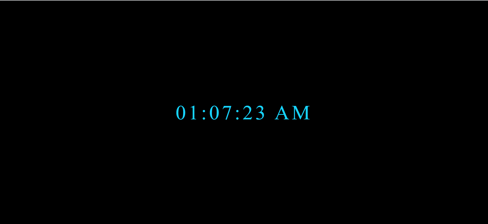
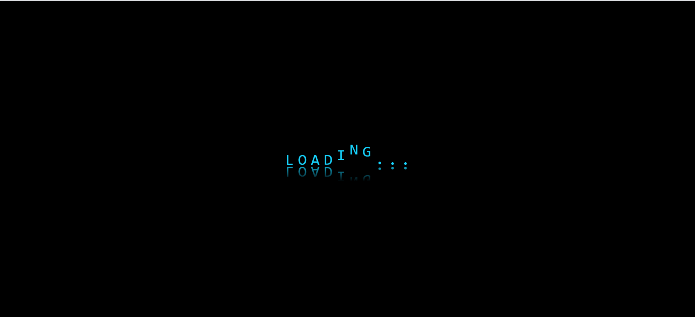

# Các Dự Án Cơ Bản (Mini) Web Bằng HTML, CSS, JavaScript

1. **DỰ ÁN #1:** *Đồng Hồ*

    Sử dụng Javascript để làm một cái đồng hồ kỹ thuật số là một dự án nhỏ tương đối dễ dàng để thực hành với các biến và các vòng lặp if đơn giản.

    

    **Link 1:** [https://dong-ho.dangdan2807.repl.co](https://dong-ho.dangdan2807.repl.co)

    **Link 2:** [https://kay-saki.000webhostapp.com/share/dong-ho/index.html](https://kay-saki.000webhostapp.com/share/dong-ho/index.html)

2. **DỰ ÁN #2:** *Chữ Loading kèm hiệu ứng*

    Tạo 1 trang web có hiện ứng Loading không cần đến Javascript

    

    **Link 1:** [https://loading-nhay-chu.dangdan2807.repl.co](https://loading-nhay-chu.dangdan2807.repl.co)

    **Link 2:** [https://kay-saki.000webhostapp.com/share/loading-nhay-chu/index.html](https://kay-saki.000webhostapp.com/share/loading-nhay-chu/index.html)
